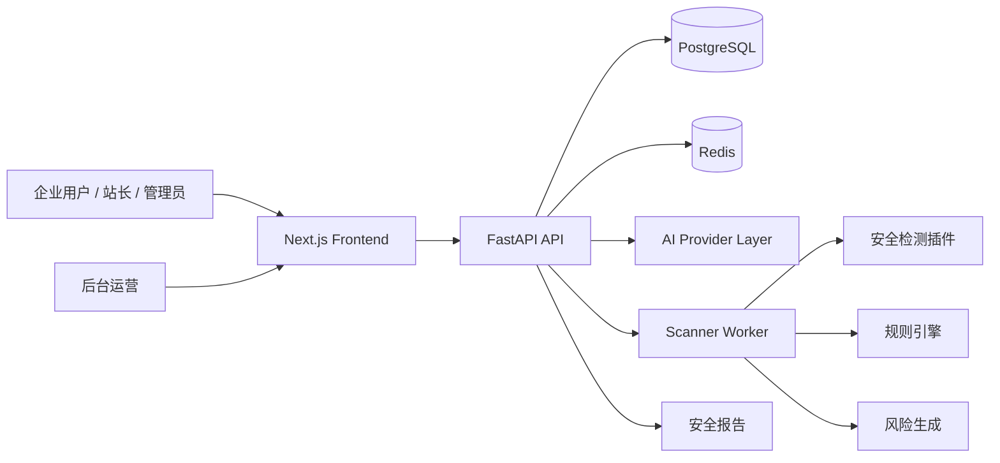
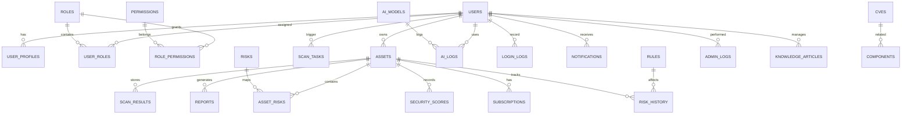
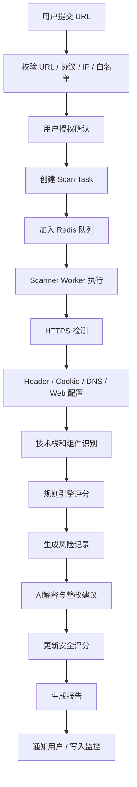

# 安盾云检项目架构说明

## 1. 项目架构

本项目采用前后端分离 + SaaS 平台架构，核心组件包括：

- 前端：Next.js 15 + TypeScript + Tailwind CSS + shadcn/ui
- 后端：FastAPI + SQLAlchemy + Alembic
- 数据库：PostgreSQL
- 缓存与任务：Redis + Celery/RQ
- AI：统一 Provider 抽象层，支持 OpenAI 兼容、DeepSeek、Qwen、本地模型接口
- 安全检测：插件式 scanner + 规则引擎 + 风险评分
- 管理后台：独立路由，支持运营、规则、AI、报告与内容管理

### 总体架构



## 2. 前后端目录树

```text
safe-website/
├── frontend/
│   ├── app/
│   │   ├── (auth)/
│   │   ├── (marketing)/
│   │   ├── (app)/
│   │   ├── admin/
│   │   ├── showcase/
│   │   ├── globals.css
│   │   └── layout.tsx
│   ├── components/
│   │   ├── ui/
│   │   ├── landing/
│   │   ├── dashboard/
│   │   └── charts/
│   ├── lib/
│   │   ├── api.ts
│   │   ├── auth.ts
│   │   ├── utils.ts
│   │   └── constants.ts
│   ├── hooks/
│   ├── public/
│   ├── package.json
│   ├── tsconfig.json
│   ├── next.config.js
│   ├── tailwind.config.ts
│   └── .env.local.example
├── backend/
│   ├── app/
│   │   ├── api/
│   │   │   ├── v1/
│   │   │   │   ├── auth.py
│   │   │   │   ├── assets.py
│   │   │   │   ├── scans.py
│   │   │   │   ├── risks.py
│   │   │   │   ├── reports.py
│   │   │   │   ├── ai.py
│   │   │   │   └── admin/
│   │   ├── core/
│   │   │   ├── config.py
│   │   │   ├── security.py
│   │   │   ├── deps.py
│   │   │   └── logging.py
│   │   ├── db/
│   │   │   ├── base.py
│   │   │   ├── session.py
│   │   │   ├── models/
│   │   │   └── migrations/
│   │   ├── schemas/
│   │   │   ├── user.py
│   │   │   ├── asset.py
│   │   │   ├── scan.py
│   │   │   ├── risk.py
│   │   │   └── ai.py
│   │   ├── services/
│   │   │   ├── auth_service.py
│   │   │   ├── scanner_service.py
│   │   │   ├── rule_engine.py
│   │   │   ├── ai_service.py
│   │   │   └── report_service.py
│   │   ├── scanner/
│   │   │   ├── dns_scanner.py
│   │   │   ├── ssl_scanner.py
│   │   │   ├── header_scanner.py
│   │   │   ├── cookie_scanner.py
│   │   │   ├── technology_scanner.py
│   │   │   ├── component_scanner.py
│   │   │   ├── web_config_scanner.py
│   │   │   ├── performance_scanner.py
│   │   │   ├── scanner_manager.py
│   │   │   └── security_constraints.py
│   │   ├── tasks/
│   │   │   ├── celery_app.py
│   │   │   └── scan_tasks.py
│   │   ├── utils/
│   │   │   ├── url_validator.py
│   │   │   ├── score_engine.py
│   │   │   ├── demo_data.py
│   │   │   └── response.py
│   │   ├── main.py
│   │   └── __init__.py
│   ├── tests/
│   │   ├── test_auth.py
│   │   ├── test_scans.py
│   │   ├── test_rules.py
│   │   └── test_security.py
│   ├── alembic.ini
│   ├── requirements.txt
│   ├── pyproject.toml
│   └── .env.example
├── docs/
│   ├── architecture.md
│   ├── api.md
│   └── security.md
├── docker/
│   ├── backend.Dockerfile
│   └── frontend.Dockerfile
├── scripts/
│   ├── init_demo.py
│   ├── seed_data.py
│   └── run_dev.sh
├── docker-compose.yml
├── .env.example
├── .gitignore
├── README.md
└── LICENSE
```

## 3. 数据库 ER 设计



## 4. 核心数据库表

关键表及字段设计：

- users：id, email, username, password_hash, is_active, is_superuser, created_at
- user_profiles：user_id, avatar_url, full_name, company_name, plan, timezone, locale
- roles：id, name, slug, description
- permissions：id, code, name, description
- role_permissions：role_id, permission_id
- user_roles：user_id, role_id
- assets：id, user_id, domain, logo_url, status, security_score, last_scan_at, created_at
- scan_tasks：id, user_id, asset_id, task_type, status, progress, started_at, finished_at
- scan_results：id, task_id, asset_id, summary_json, raw_response, created_at
- security_rules：id, rule_code, name, category, severity, detection_mode, enabled, score_impact
- risks：id, asset_id, rule_id, name, severity, description, evidence, advice, reference, status
- asset_risks：asset_id, risk_id, first_seen, last_seen, status
- risk_history：id, asset_id, score, risk_count, status, recorded_at
- security_scores：id, asset_id, total_score, dimension_scores, created_at
- reports：id, asset_id, user_id, score, risk_count, report_type, content_json, status
- ai_models：id, provider, api_base_url, model_name, api_key_mask, is_default, status
- ai_prompts：id, prompt_type, template, variables, version
- ai_logs：id, user_id, asset_id, function_name, model_name, tokens, latency_ms, status
- cves：id, cve_id, name, component, affected_version, cvss, severity, published_at
- components：id, asset_id, name, version, type, risk_level, source
- knowledge_articles：id, title, slug, category, summary, content_markdown, is_published
- notifications：id, user_id, type, title, message, read_at
- subscriptions：id, user_id, plan, status, started_at, expires_at
- admin_logs：id, admin_user_id, action, target_type, target_id, ip_address, result
- system_settings：key, value, description
- login_logs：id, user_id, ip_address, user_agent, login_time, status

## 5. API 列表

### 用户接口

- POST /api/v1/auth/register
- POST /api/v1/auth/login
- POST /api/v1/auth/refresh
- GET /api/v1/auth/me

### 资产与扫描

- GET /api/v1/assets
- POST /api/v1/assets
- GET /api/v1/assets/{id}
- POST /api/v1/scans
- GET /api/v1/scans/{id}
- GET /api/v1/scans

### 风险与报告

- GET /api/v1/risks
- GET /api/v1/risks/{id}
- GET /api/v1/reports
- POST /api/v1/reports/{id}/generate
- GET /api/v1/reports/{id}

### AI

- POST /api/v1/ai/explain
- POST /api/v1/ai/plan
- POST /api/v1/ai/report
- GET /api/v1/ai/models

### 管理后台

- /api/v1/admin/users
- /api/v1/admin/assets
- /api/v1/admin/scans
- /api/v1/admin/rules
- /api/v1/admin/cves
- /api/v1/admin/ai
- /api/v1/admin/reports
- /api/v1/admin/articles
- /api/v1/admin/system

## 6. 页面列表

### 前台

- 首页 /
- 安全检测 /scan
- AI 安全顾问 /advisor
- 风险中心 /risks
- 安全报告 /reports
- 解决方案 /solutions
- 安全知识库 /knowledge
- 登录 /login
- 注册 /register
- 个人中心 /profile
- 资产中心 /assets
- 展示页 /showcase

### 后台

- /admin
- /admin/users
- /admin/assets
- /admin/scans
- /admin/rules
- /admin/cves
- /admin/ai
- /admin/reports
- /admin/articles
- /admin/settings
- /admin/logs

## 7. UI 设计规范

### 风格方向

- 暗色科技风：深黑、深蓝、银灰、紫蓝渐变
- 视觉语言：glassmorphism + 渐变边框 + 稳定的高级动画
- 重点元素：安全评分、风险雷达、趋势线、扫描进度、数据报表
- 设计原则：专业但不炫俗，技术感强但不“黑客风”

### 组件规范

- 卡片：16-24px 圆角，轻微边框，高透明度背景
- 按钮：主CTA为蓝紫渐变，次要按钮为深色透明带边框
- 字体：Inter / SF Pro / Noto Sans SC
- 图表：使用 Recharts / ECharts，统一配色：蓝、紫、青、橙、红
- 动效：0.2s-0.6s 动画缓动，避免过度闪烁

### 关键页面要求

- 首页：强调 AI, 安全评分, 低门槛 SaaS, 解读报告
- 登录页：双栏设计，左侧科技动画，右侧表单
- Dashboard：大屏数据驾驶舱，适配 1920x1080 展示
- 高级报告页：企业审计风格，适合投屏答辩

## 8. 扫描流程图



## 9. 规则引擎与评分逻辑

- 评分总分 100
- 维度：基础安全 20, HTTPS 安全 20, Web 配置 20, 应用风险 20, 信息暴露 10, 安全运营 10
- 规则引擎负责扣分：不同规则对应 severity 和 score_impact
- AI 只负责解释和建议，不直接产出最终分数
- 评分结果映射：90-100 优秀；80-89 良好；60-79 存在风险；40-59 高风险；0-39 严重风险

## 10. 安全设计原则

- 仅允许 http / https
- 禁止内网、回环、私网、metadata、localhost
- 仅基于安全自检与授权目标进行 requests
- 限制请求数、最大页面 size、重定向次数、最大扫描时间
- 使用专用 User-Agent：SafeSight-Security-Scanner/1.0
- 所有结果必须明确标注为“演示数据”或真实检测数据

## 11. 开发阶段规划

### Phase 1：项目初始化

- 创建 frontend / backend / docs / docker / scripts
- 完成 docker-compose 与基础配置
- 准备 PostgreSQL 与 Redis

### Phase 2：数据库与认证

- 完成 SQLAlchemy 模型
- 实现 JWT + Refresh Token
- 分配 RBAC 权限与 admin 初始化脚本

### Phase 3：前端基础 UI

- 首页、登录、Dashboard 先实现骨架与风格

### Phase 4：资产管理

- 新增资产、网站卡片、扫描入口、资产详情

### Phase 5：扫描任务系统

- 建立任务队列、状态流转、进度展示

### Phase 6：基础检测插件

- HTTPS、Header、Cookie、DNS、技术栈识别

### Phase 7：规则引擎与风险中心

- 打分、风险生成、状态跟踪

### Phase 8：AI 安全顾问

- 风险解释、整改建议、优先级排序

### Phase 9：安全报告

- 静态报告页、导出 PDF、分享链接

### Phase 10：后台管理系统

- 用户、资产、风险、规则、AI 模型管理

### Phase 11：大数据 Dashboard

- 运营指标、风险分布、趋势图

### Phase 12：Demo 数据

- 演示管理员、用户、资产、扫描记录

### Phase 13：UI 优化

- 数据卡片、图表、动画、响应式优化

### Phase 14：测试、安全加固与 README

- Unit Test / API Test / Frontend Test
- 安全合规与文档完善

## 12. 结论

本项目以“AI + 规则引擎 + 安全SaaS”作为核心定位，重点满足中小企业安全自检场景。其核心价值不在于攻击能力，而在于：让普通企业用户更容易理解风险、获得解释、知道修复顺序、建立持续监控闭环。
